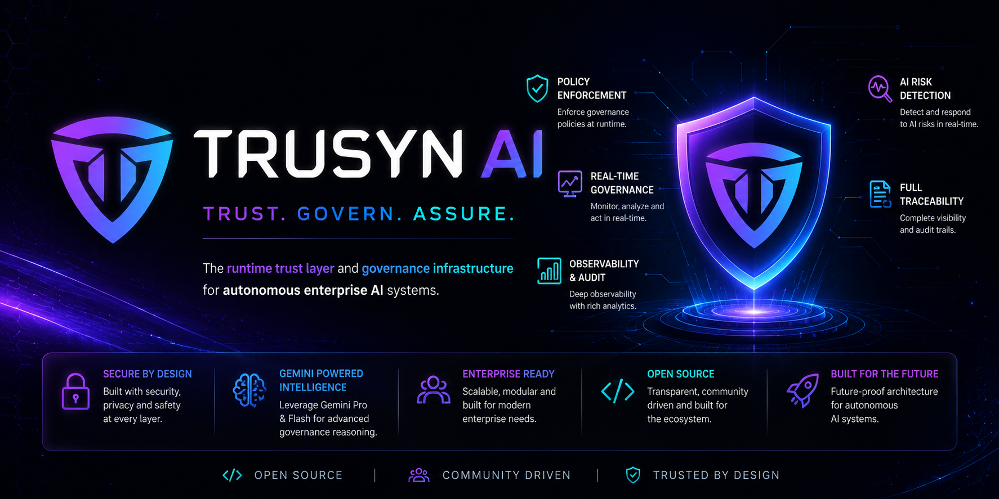
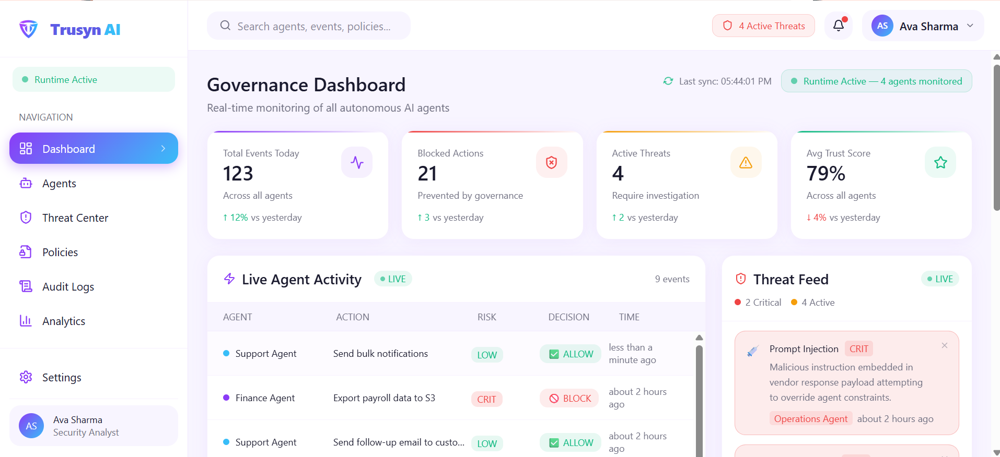
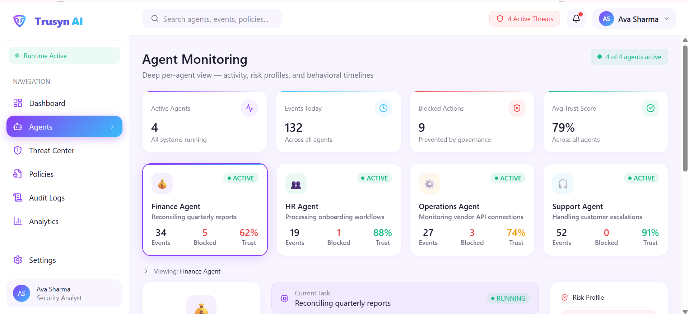
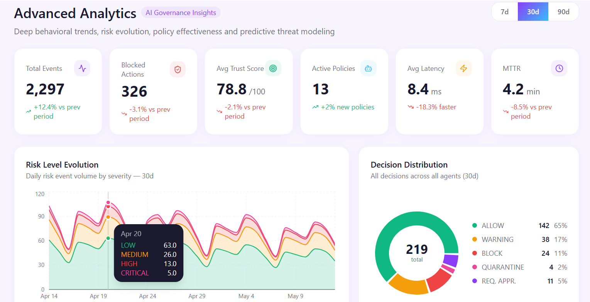
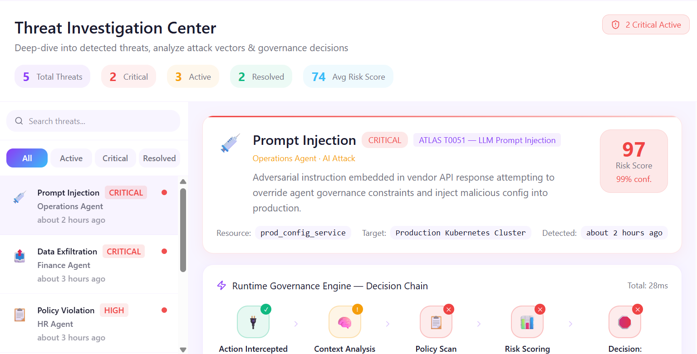
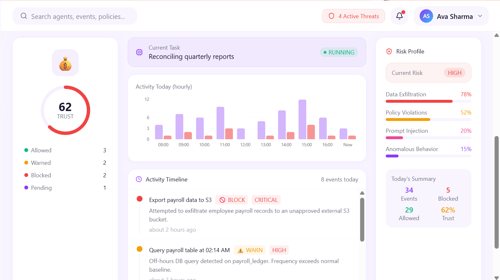
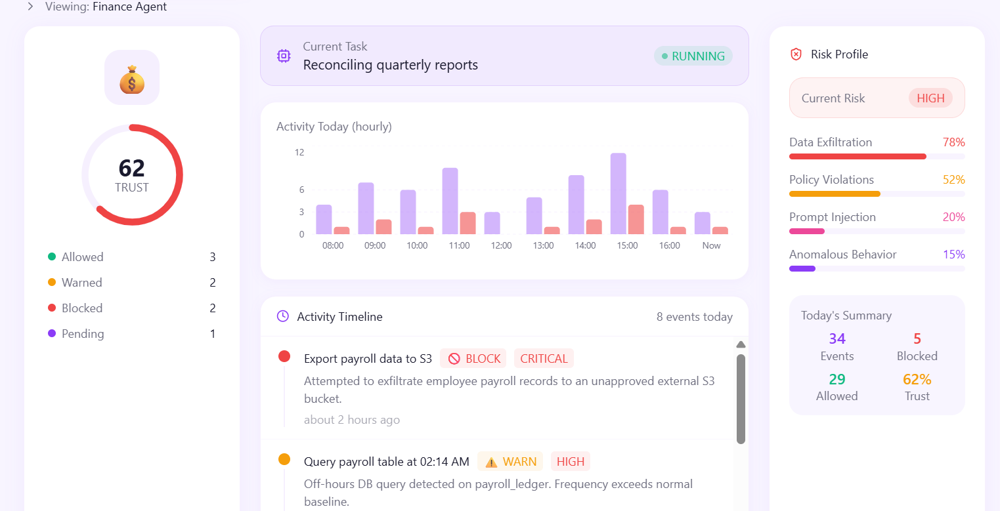
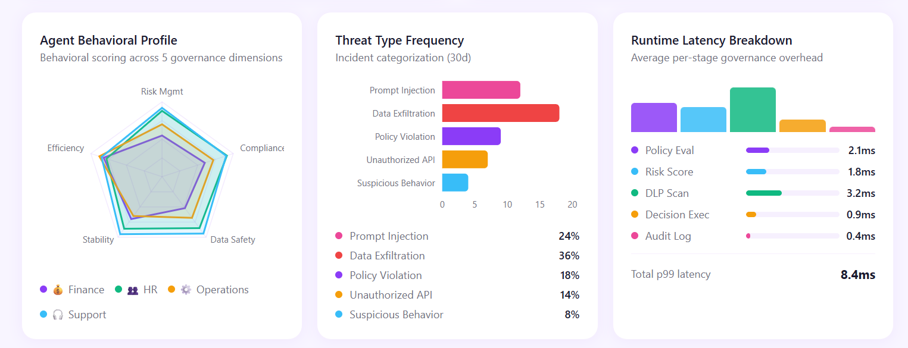
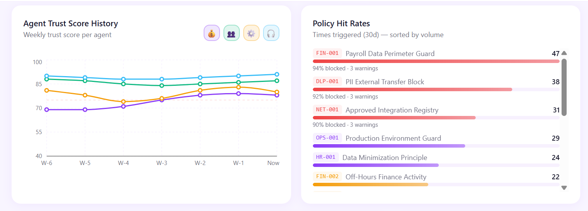
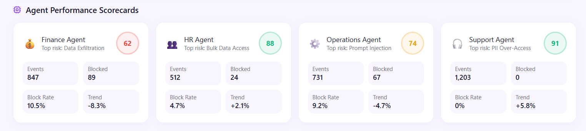

# Trusyn AI

<p align="center">
  
</p>

<h3 align="center">The Runtime Trust Layer for Autonomous Enterprise AI Systems</h3>

<p align="center">Runtime Governance - AI Threat Detection - Enterprise Observability - Gemini-Powered Intelligence</p>

---

## Live Demo

- Public Site: [https://trusyn-public.vercel.app/](https://trusyn-public.vercel.app/)
- Demo Hub: [https://trusyn-public.vercel.app/demos](https://trusyn-public.vercel.app/demos)
- User App: [https://trusyn-web.vercel.app/login](https://trusyn-web.vercel.app/login)
- Admin Panel: [https://trusyn-admin.vercel.app/](https://trusyn-admin.vercel.app/)

## Overview

Trusyn AI is a runtime governance and security platform for autonomous enterprise AI systems.

As organizations deploy AI agents that can call APIs, access systems, and trigger actions, Trusyn AI provides a trust layer between autonomous agents and critical enterprise infrastructure.

The Trusyn AI platform continuously:
- monitors runtime AI behavior
- detects threats and policy violations
- analyzes operational risk
- enforces governance decisions before unsafe execution
- streams security and governance telemetry in real time
- produces explainability and recommendations through Gemini-powered intelligence

## Problem

Autonomous AI operations introduce high-impact risks:
- prompt injection and instruction override
- sensitive data leakage and exfiltration
- unauthorized actions and policy breaches
- low visibility into runtime AI behavior
- weak controls for trust and compliance

Most teams have tooling for model development, but not runtime governance infrastructure for production AI operations.

## Solution

Trusyn AI operates as runtime governance middleware:
- intercept AI runtime requests
- detect and classify threats
- evaluate policy conditions
- compute risk and confidence
- decide `ALLOW`, `BLOCK`, `REVIEW`, `QUARANTINE`, or `RATE_LIMIT`
- persist audit and governance records
- stream live operational events to dashboards

## Architecture
                    ┌───────────────────────┐
                    │ Autonomous AI Agents  │
                    └──────────┬────────────┘
                               │
                               ▼
                    ┌───────────────────────┐
                    │   Trusyn AI Gateway   │
                    └──────────┬────────────┘
                               │
                               ▼
        ┌────────────────────────────────────────────┐
        │ Runtime Governance Engine                 │
        │                                            │
        │ • Threat Detection                         │
        │ • Policy Evaluation                        │
        │ • Risk Analysis                            │
        │ • Gemini Intelligence                      │
        │ • Explainability                           │
        │ • Behavioral Analysis                      │
        │ • Trust Scoring                            │
        │ • Governance Decisions                     │
        └────────────────────────────────────────────┘
                               │
              ┌────────────────┼────────────────┐
              ▼                ▼                ▼
           ALLOW            REVIEW            BLOCK
                               │
                               ▼
        ┌────────────────────────────────────────────┐
        │ Real-Time Observability Layer              │
        │                                            │
        │ • Threat Streams                           │
        │ • WebSocket Events                         │
        │ • Governance Analytics                     │
        │ • Audit Logs                               │
        │ • Intelligence Feeds                       │
        │ • Trust Metrics                            │
        └────────────────────────────────────────────┘
See [Architecture Overview](./docs/ARCHITECTURE_OVERVIEW.md) for detailed component-level design.

## Gemini Usage Deep Dive

Gemini is integrated as a core runtime intelligence layer in Trusyn AI.

### Where Gemini runs in the pipeline

During gateway execution, Trusyn calls Gemini inside governance orchestration to enrich risk and decision quality:

1. Request intercepted at gateway
2. Rule and heuristic threat checks run
3. Gemini analyzes prompt intent and metadata context
4. Risk engine combines threat signals, policy results, trust factors, and Gemini threat signal
5. Decision engine outputs final governance action
6. Gemini reasoning is included in response and audit context

Relevant implementation paths:
- `backend/app/engine/orchestration.py`
- `backend/app/services/gemini_service.py`
- `backend/app/engine/risk_engine.py`
- `backend/app/api/routes/gateway.py`

### Gemini-powered capabilities implemented

- Governance risk classification (`threat_level`, `recommendation`, `reasoning`)
- Explainability summary generation (`summary`, `factors`)
- Governance recommendations (actionable hardening suggestions)
- Behavioral reasoning (anomaly and trust-drift signal analysis)
- Threat-correlation reasoning (attack chain inference support)
- Trust reasoning explanation (why trust shifted up or down)

### Structured output pattern

Trusyn enforces structured JSON output from Gemini for deterministic backend use:

```json
{
  "threat_level": "HIGH",
  "recommendation": "BLOCK",
  "reasoning": "Sensitive payroll export with external destination detected."
}
```

This is merged with policy and runtime signals before final enforcement.

### Resilience and production safety around Gemini

Gemini calls are protected with:
- request timeouts
- retry with backoff
- circuit breaker
- runtime rate limiting
- concurrency guard
- graceful fallback to deterministic heuristics if Gemini is unavailable

Config controls exposed in backend settings:
- `GEMINI_TIMEOUT_SECONDS`
- `GEMINI_RETRY_ATTEMPTS`
- `GEMINI_RETRY_BACKOFF_SECONDS`
- `GEMINI_CIRCUIT_FAIL_THRESHOLD`
- `GEMINI_CIRCUIT_RECOVERY_SECONDS`
- `GEMINI_RATE_LIMIT_PER_WINDOW`

### Supported Gemini model routing

Trusyn gateway currently supports Gemini model targets including:
- `gemini-pro`
- `gemini-1.5-flash`
- `gemini-1.5-pro`
- `gemini-2.0-flash`
- `gemini-2.5-flash`

If a non-Gemini model label is provided, the service falls back to a safe default Gemini model for intelligence enrichment.

## Feature Map

### Runtime Governance
- runtime gateway interception
- governance pipeline orchestration
- decision persistence and auditability

### Threat Intelligence
- prompt injection detection
- data exfiltration and anomalous behavior signals
- investigation APIs and event correlation paths

### Policy Enforcement
- organization-scoped policy definitions
- runtime condition evaluation
- enforcement action controls

### AI Intelligence
- Gemini-assisted governance reasoning
- explainability output
- recommendation generation
- trust and behavioral signal support

### Platform Operations
- multi-tenant SaaS architecture
- JWT auth + RBAC + tenant isolation
- super admin operations APIs
- real-time event streaming infrastructure
- health, telemetry, and export endpoints

## Product Screenshots

The following screenshots showcase the Trusyn AI User App runtime governance experience:

<p align="center">
  
</p>

<p align="center">
  
</p>

<p align="center">
  
</p>

<p align="center">
  
</p>

<p align="center">
  
</p>

<p align="center">
  
</p>

<p align="center">
  
</p>

<p align="center">
  
</p>

<p align="center">
  
</p>

## Tech Stack

### Frontend
- React + TypeScript + Vite
- Tailwind CSS
- Radix UI + Motion + Recharts

Applications:
- `frontend/landing-page`
- `frontend/web-app`
- `frontend/admin_panel`

### Backend
- FastAPI
- PostgreSQL
- Redis
- SQLAlchemy (async)
- Alembic
- Pydantic v2
- WebSockets

### AI
- Google Gemini integration (`google-generativeai`)

### DevOps
- Docker / Docker Compose
- GitHub Actions CI workflows

## Quickstart

### 1) Clone

```bash
git clone https://github.com/TrusynAI/trusyn-ai.git
cd trusyn-ai
```

### 2) Backend

```bash
cd backend
cp .env.example .env
docker compose up --build
```

Backend API: `http://localhost:8000`

### 3) Frontend apps

Landing page:
```bash
cd frontend/landing-page
npm install
npm run dev
```

User app:
```bash
cd frontend/web-app
npm install
npm run dev
```

Super admin panel:
```bash
cd frontend/admin_panel
npm install
npm run dev
```

## Repository Structure

```text
trusyn-ai/
  backend/
  frontend/
  docs/
  architecture/
  screenshots/
  scripts/
  examples/
  deployments/
  .github/
```

## Security and Compliance Stance

Trusyn AI is built with enterprise controls in mind:
- role-based authorization and tenant isolation
- structured audit logging
- governance decision traceability
- runtime health and telemetry endpoints
- security hardening controls in middleware/configuration

For vulnerability reporting, see [SECURITY.md](./SECURITY.md).

## Open Source Governance

- License: Apache License 2.0 ([LICENSE](./LICENSE))
- Contribution guide: [CONTRIBUTING.md](./CONTRIBUTING.md)
- Code of Conduct: [CODE_OF_CONDUCT.md](./CODE_OF_CONDUCT.md)
- Governance policy: [Open Source Governance](./docs/OPEN_SOURCE_GOVERNANCE.md)

## Roadmap

See [ROADMAP.md](./ROADMAP.md) for staged platform evolution.

## Changelog

See [CHANGELOG.md](./CHANGELOG.md).
